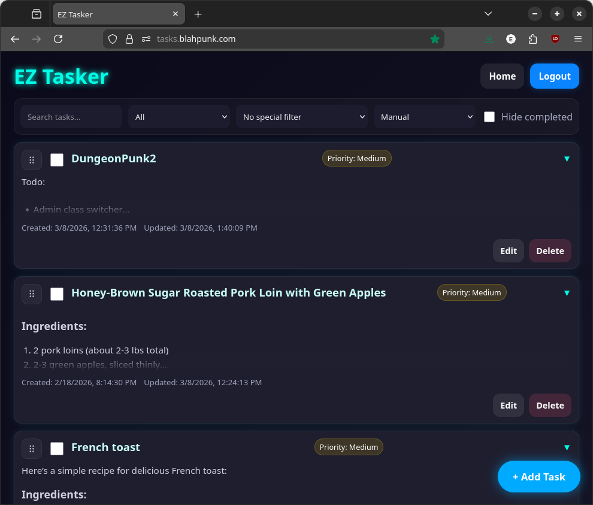
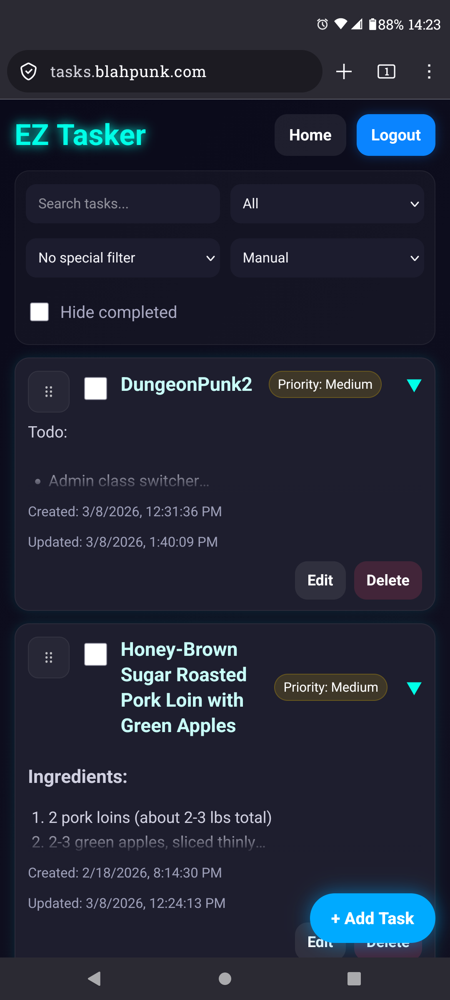

# EZ Tasker (`tasks.blahpunk.com`)

Self-hosted task manager written in plain PHP with SQLite storage.

## Overview

- Backend: single entrypoint [`index.php`](/var/www/tasks.blahpunk.com/index.php)
- Frontend assets: `static/css/*`, `static/js/scripts.js`
- Storage: SQLite (`tasks`, `tags`, `task_tags`, `app_meta`)
- Auth: cookie bootstrap from `secure.blahpunk.com` (`user` + `user_sig`)
- Data security: task title/description encrypted at rest with a Fernet-compatible key split

## Features

- Create, update, complete, delete tasks
- Drag-and-drop manual ordering
- Due dates, priority, tags
- Search/filter/sort options
- CSRF protection on write APIs
- Legacy task migration support
- Automatic encryption migration for existing task content

## Screenshots

Main app view:



Task list and editor state:




## Requirements

- PHP 8.1+ (8.2 recommended)
- PHP extensions:
  - `pdo_sqlite`
  - `openssl`
  - `mbstring`
  - `dom`
- Web server (Nginx or Apache) with PHP-FPM/mod_php
- TLS in production (security headers and secure cookies assume HTTPS)

## Repository Layout

- [`index.php`](/var/www/tasks.blahpunk.com/index.php): all server routing, auth checks, API handlers, DB init, encryption
- [`static/js/scripts.js`](/var/www/tasks.blahpunk.com/static/js/scripts.js): UI logic and API calls
- [`static/css/styles.css`](/var/www/tasks.blahpunk.com/static/css/styles.css): main app styles
- [`static/css/login_prompt.css`](/var/www/tasks.blahpunk.com/static/css/login_prompt.css): login prompt styles
- [`.env`](/var/www/tasks.blahpunk.com/.env): runtime config (not committed)

## Environment Variables

The app loads `.env` automatically at startup.

Required:

- `SECRET_KEY`: app secret (must not be `change-me`)
- `SECURE_AUTH_SECRET`: shared HMAC secret used to verify `user_sig`
- `USER_ID_SECRET`: HMAC secret for stable user namespace IDs
- `DATA_ENCRYPTION_KEY`: URL-safe base64 32-byte key (Fernet-style)
- `BOOTSTRAP_COOKIE_AUDIENCE`: expected `aud` claim for bootstrap cookie payload

Optional:

- `DATA_DIR` (default `/var/lib/ez_tasker`)
- `DB_PATH` (default `${DATA_DIR}/tasks.db`)
- `STATIC_ASSET_VERSION` (cache-busting token)
- `BOOTSTRAP_COOKIE_MAX_AGE_SECONDS` (default `300`)
- `BOOTSTRAP_COOKIE_CLOCK_SKEW_SECONDS` (default `60`)

## Generate Secrets

Use strong random values:

```bash
# 64 hex chars
openssl rand -hex 32

# URL-safe base64 for DATA_ENCRYPTION_KEY (32 raw bytes)
openssl rand -base64 32 | tr '+/' '-_' | tr -d '=\n'
```

## Setup

1. Clone and enter project:

```bash
git clone <repo-url> /var/www/tasks.blahpunk.com
cd /var/www/tasks.blahpunk.com
```

2. Create `.env`:

```dotenv
SECRET_KEY=<strong-random-secret>
SECURE_AUTH_SECRET=<shared-secret-with-secure-auth-service>
USER_ID_SECRET=<strong-random-secret>
DATA_ENCRYPTION_KEY=<urlsafe-base64-32-byte-key>
BOOTSTRAP_COOKIE_AUDIENCE=tasks.blahpunk.com
BOOTSTRAP_COOKIE_MAX_AGE_SECONDS=300
BOOTSTRAP_COOKIE_CLOCK_SKEW_SECONDS=60
# Optional:
# DATA_DIR=/var/lib/ez_tasker
# DB_PATH=/var/lib/ez_tasker/tasks.db
# STATIC_ASSET_VERSION=20260308
```

3. Create writable data directory:

```bash
sudo mkdir -p /var/lib/ez_tasker
sudo chown -R www-data:www-data /var/lib/ez_tasker
sudo chmod 770 /var/lib/ez_tasker
```

4. Verify PHP syntax:

```bash
php -l index.php
```

5. Start server and open app.

## Local Development

Quick local run:

```bash
php -S 127.0.0.1:8080 index.php
```

Then visit `http://127.0.0.1:8080/`.

Notes:

- Login is enforced. Without valid bootstrap cookies from your auth service, you will be redirected to `/login`.
- If you run this outside the production domain setup, ensure your auth bootstrap flow and cookie secrets still match.

## Web Server Routing

App behavior expects:

- Dynamic routes handled by `index.php`
- Static files served from `static/`
- Asset URLs are emitted as `/tasks/static/...`

If your public base path is different, adjust one of:

- reverse proxy path mapping, or
- asset URL generation in [`index.php`](/var/www/tasks.blahpunk.com/index.php)

### Nginx (example)

```nginx
server {
    listen 443 ssl;
    server_name tasks.blahpunk.com;

    root /var/www/tasks.blahpunk.com;
    index index.php;

    location /tasks/static/ {
        alias /var/www/tasks.blahpunk.com/static/;
        access_log off;
        expires 7d;
    }

    location / {
        try_files $uri /index.php?$query_string;
    }

    location ~ \.php$ {
        include snippets/fastcgi-php.conf;
        fastcgi_pass unix:/run/php/php8.2-fpm.sock;
        fastcgi_param SCRIPT_FILENAME $document_root$fastcgi_script_name;
    }
}
```

## Authentication Contract

The app trusts two cookies:

- `user`: base64url JSON claims including `email`, `aud`, `iat`, `exp` (and optional `nbf`)
- `user_sig`: `sha256` HMAC signature over the raw `user` cookie using `SECURE_AUTH_SECRET`

Validation performed server-side:

- signature match
- email format
- audience match against `BOOTSTRAP_COOKIE_AUDIENCE`
- claim window checks (`iat`, `exp`, `nbf`) with configured skew and max-age

Login URL is built as:

- `https://secure.blahpunk.com/oauth_login?next=https://tasks.blahpunk.com&aud=<aud>&max_age=<seconds>`

## API Endpoints

All endpoints are in [`index.php`](/var/www/tasks.blahpunk.com/index.php).

Main API:

- `GET /api/v1/tasks`
- `POST /api/v1/tasks`
- `PUT /api/v1/tasks/{id}`
- `DELETE /api/v1/tasks/{id}`
- `POST /api/v1/tasks/reorder`
- `GET /api/v1/tags`

Compatibility aliases:

- `GET /api/tasks` -> list tasks
- `POST /api/tasks` -> create task
- `POST /api/tasks/order` -> reorder tasks

Write endpoints require CSRF header:

- `X-CSRF-Token: <token from meta[name="csrf-token"]>`

## Database

SQLite DB auto-creates on first run at `DB_PATH`.

Tables:

- `tasks`
- `tags`
- `task_tags`
- `app_meta`

Indexes and schema are initialized automatically in `init_db()`.

## Security Notes

- Task content is encrypted before storing (`title`, `description_html`, `description_text`)
- HTML descriptions are sanitized with allowlisted tags/attributes/protocols
- CSRF enforced on mutating APIs
- Session cookies use `HttpOnly`, `SameSite=Lax`, and `Secure` on HTTPS
- Security headers are set on responses (HSTS, no-sniff, frame deny, referrer policy)

## Operational Notes

- On startup, any plaintext legacy task content is migrated to encrypted values.
- Legacy per-email JSON task files are imported once for users with no DB tasks.
- `STATIC_ASSET_VERSION` can be set for deterministic cache busting during deploys.

## Troubleshooting

- `Server misconfigured.` response:
  - verify required `.env` values
  - verify `DATA_ENCRYPTION_KEY` decodes to exactly 32 bytes
- Redirect loop to `/login`:
  - verify `user` and `user_sig` cookies are present
  - verify `SECURE_AUTH_SECRET` and cookie `aud/iat/exp` claims
- DB errors:
  - confirm PHP has `pdo_sqlite`
  - confirm web user can write `DATA_DIR`
- Broken styling/scripts:
  - confirm `/tasks/static/*` is mapped to project `static/`

## Deployment Checklist

- `.env` present with strong secrets
- writable `DATA_DIR` and DB path
- PHP extensions installed
- HTTPS enabled
- static path mapping verified (`/tasks/static/...`)
- auth service cookie contract verified
- `php -l index.php` clean

